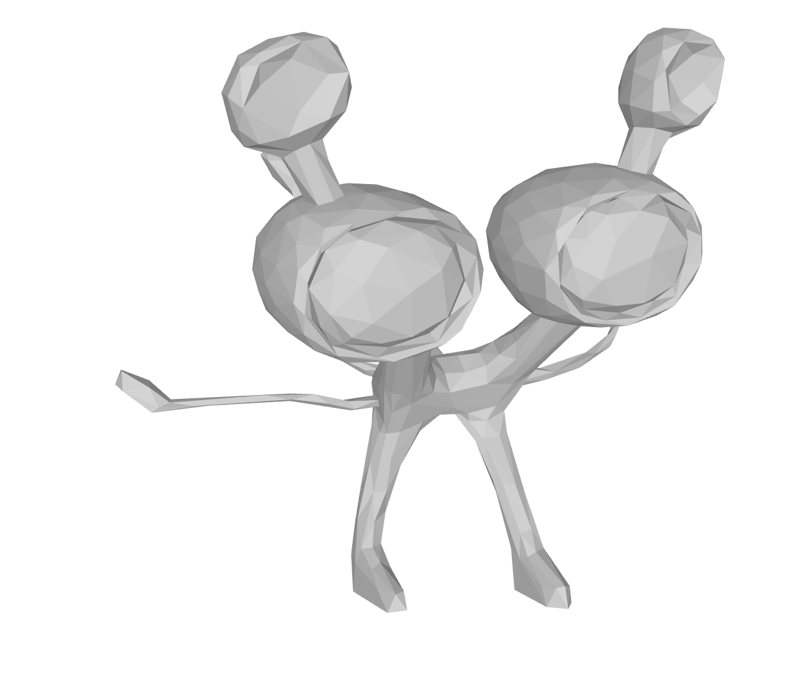
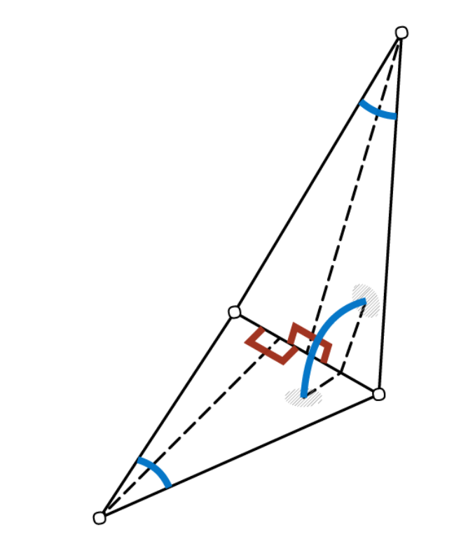
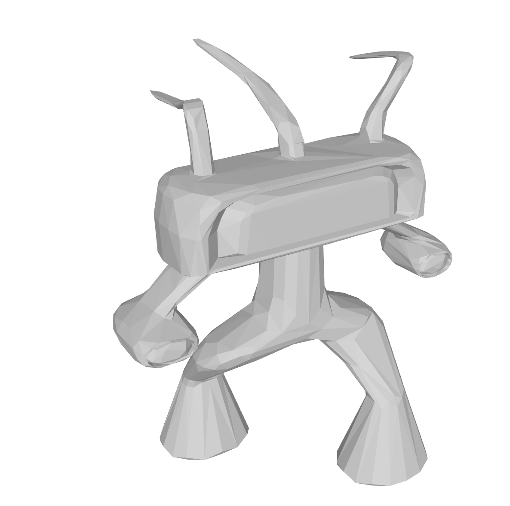
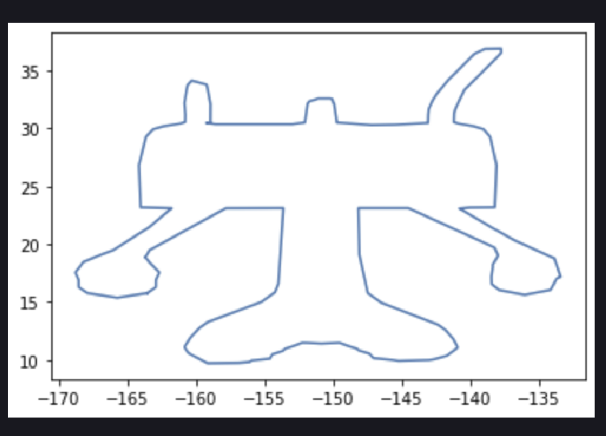
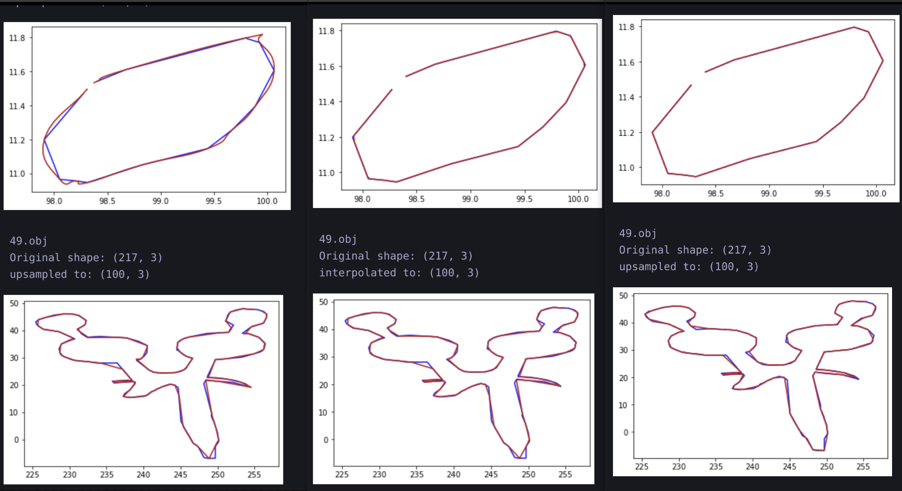

# 3D_slAIcer

Exploring NN architectures to slice 3D meshes for 3D printing

Model and learning are in 3D_slAIcer.ipynb
Data generation code in dataGeneration.ipynb

# Write up

## Input Features

The data for this project are edge features from OBJ CAD files. The OBJ files are from The Shape COSEG dataset: http://irc.cs.sdu.edu.cn/~yunhai/public_html/ssl/ssd.htm. I implemented classes to read the vertices and faces on an OBJ file and calculate edge features on which my model trains.

Figure 1: Sample obj file from coseg dataset

We first read in a triangle mesh as list of faces and edges. This is done using the _readFile_ method from the Obj2verts class (obj2verts.py).
Given a triangle mesh, we loop through all faces and the vertices that form those faces. An edge can be defined by 2 common vertices of 2 adjascent triangles. This is done by the _findEdges_ method of Obj2verts.

Once the edges are available, we must calculate the features of this edge. These are the features that will be used to train the model. Hanocka, et al [1] have implemented a meshCNN for the task of 3D mesh classification. meshCNN also learns on edge features. In [1] they define the following edge features:

Figure 2: The 5 edge features fron meshCNN [1]

- Dihedral angle: The Angle between the 2 adjascent faces that form the edge
- 2 Inner angles: The angles opposite to the edge
- 2 Edge-length ratios: The ratios of the length of the endge to the height of of the triangles

In meshCNN, each 2 face-based feature in sorted to avoid ordering ambiguity and ensure invariance.

In 3D_slAIcer we calculate the same features using the methods in obj2verts.py.

- Dihedral angle:

Given 2 faces, their normals are calculated using the cross product of 2 vectors on a face. Then, using the dot product formula
$a.b = |a||b|cos(\theta)$ where a and b are the normal vectors. We solve for $\theta$ which gives us the dihedral angle

- Inner angles: The inner angles are calculated using the dot product formula on the 2 edges of each face that are not shared with the adjascent face.

- Edge-lenth ratio: To find the lenght of the base we just calculate the lenGth of the vector between the 2 vertices that define an edge. Then to find the height of each triangle, we first use Heron's formula for the area of a triangle: $A = \sqrt{s(s-a)*s(s-b)*s(s-c)}$ where $s = (a+b+c)/2$ and $a, b, c$ are the length of each edge of the triangle. Then knowing the area and base length we calculate the height using $h = A*2/base$

Therefore, the dimensionality of the inputs is $nx5$ where n is the number of edges in a mesh. To make this input size uniform for all meshes, we implement an edge pooling when processing the data before feeding it to the network. We first define an edge resolution of 450. The 450 "strongest" edges (edges with the hihgest l2 norm), that is 1 edge per batch of $nEdges/resolution$ over all the edges in a mesh.

## Labels

The labels for each mesh is a single slice calculated by intersecting a cutting place with the mesh. The normal of the cutting plane points in the postive z direction and its origin is at the first vertex of the mesh.

Figure 3: Example input triangle mesh

Figure 4: Example ground truth slice

The ground truth labels were generated using using the ObjSlicer class which calls the _cross_section_cut_ method from meshcut.py[2]. _cross_section_cut_ returns polylines describing the slice. However, the number of points from slicing one file to the next varies. In order to ensure the the dimensinality of the labels for all samples is the same, the number of points in the calculated slices are first upsampled to 10000 then downsampled to 200. Therfore each labels has a shape of $100x2$. Upsampling the points required interpolation, different interpolatin algorithms were tested to find the best one.

Figure 5: From left to right: cubic, linear, and nearest neighbor interpolation. Blue is ground truth, red is interpolated

Based on these results, nearest neighbor interpolation was used.

## References

[1] Hanocka, R., Hertz, A., Fish, N., Giryes, R., Fleishman, S., & Cohen-Or, D. (2019). Meshcnn. ACM Transactions on Graphics, 38(4), 1–12. https://doi.org/10.1145/3306346.3322959

[2] https://github.com/julienr/meshcut/blob/master/meshcut.py

<!-- ## Obj2MeshVerts in obj2verts.py:

Methods:

*  **readFile**:
    Takes in a file path and returns a geometry object containing a list of the vertices and triangles of the obj file

 ## ObjGeometry in obj2verts.py:

 Methods:

 * **calculateFeatures**:  -->
